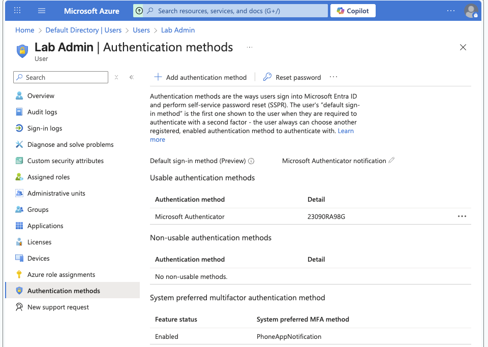
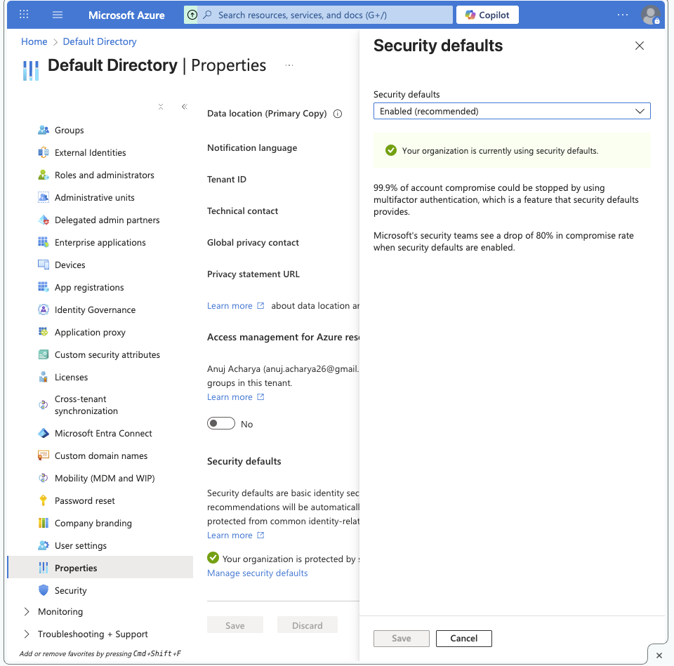

# Entra Lab 04 — Admin MFA Enrollment (Proof)

## Objective
Validate separate admin identity and MFA enrollment.

## Actions performed
- Created and used a dedicated admin user: `labadmin@anujacharya26gmail.onmicrosoft.com`
- Signed in in an isolated session (incognito)
- Registered Microsoft Authenticator as MFA method

## Why this matters
- Separate admin identity reduces exposure of privileged roles.
- MFA for admins is the baseline control for preventing account takeover.

## Evidence

