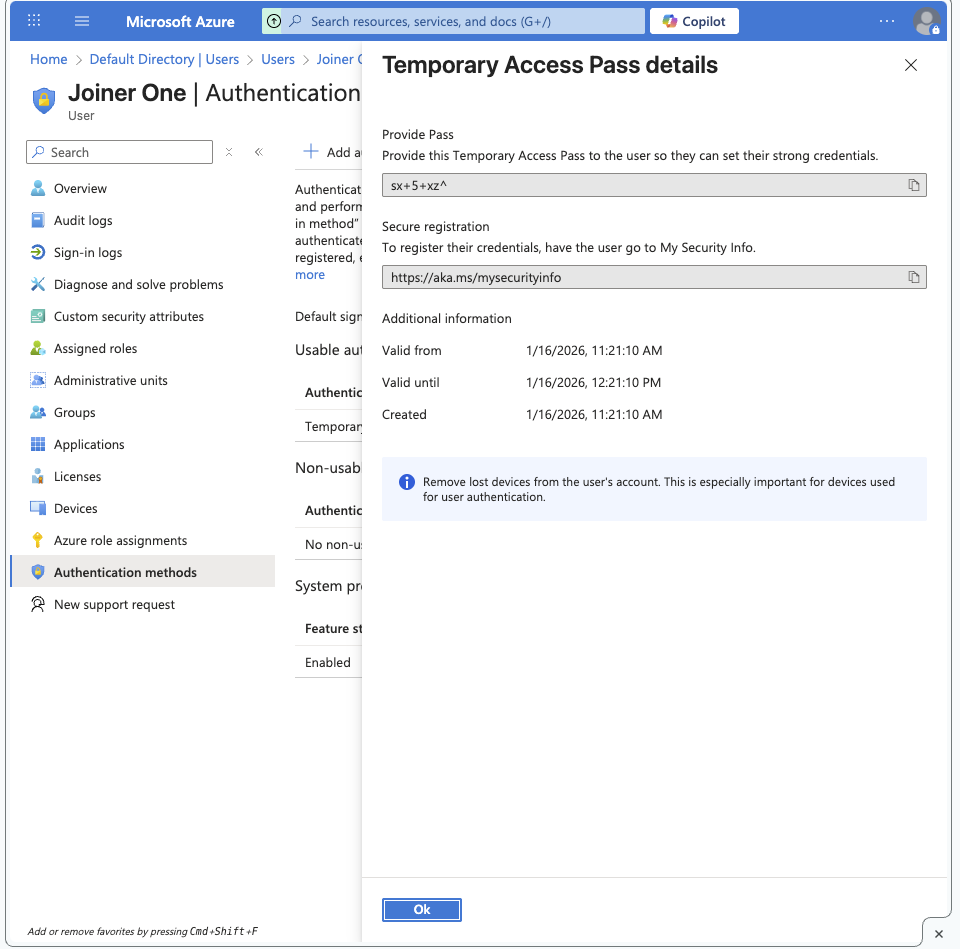

# Entra Lab 05 — Temporary Access Pass (TAP) Onboarding Workflow

## Objective
Demonstrate a helpdesk-friendly onboarding method to securely bootstrap MFA.

## Workflow (enterprise pattern)
1) Admin issues a Temporary Access Pass (TAP) for a new user (Joiner).
2) User signs in using TAP (instead of password) for first-time access.
3) User registers Microsoft Authenticator / MFA methods.
4) TAP expires automatically; admin can revoke sessions if needed.

## Why TAP is useful
- Avoids sharing admin devices or SMS-based bootstrapping.
- Time-bound access reduces risk.
- Matches real-world ITSM onboarding processes.

## Evidence

